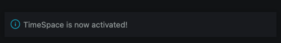
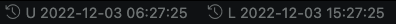
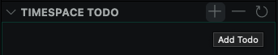
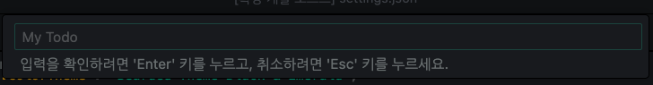
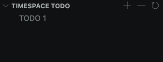
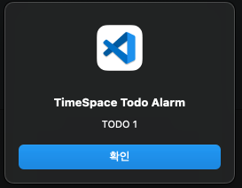

# TimeSpace

## Features

Simply show & copy UTC your locale time in your status bar with customized format.  
Todo and alarm with customized time format.

## Requirements

This extension has dependencies down below;

-   day.js

## Extension Settings

Installation is easy. _Just Install_.

-   Find `TimeSpace` in market place
-   Just install

then, You will see a information message Like,  


Also you can see time block in your down status bar.  


Format and copy format setting  
You can change in `settings.json` like down blow.

```json
// Default format : `YYYY-MM-DD HH:mm:ss`
// All optional.
"timeSpace.formatUTC": "YYYY-MM-DD HH:mm:ss",
"timeSpace.formatLocale": "YYYY-MM-DD h:mm:ss A",
"timeSpace.copyFormatUTC": "YYYY-MM-DD HH:mm:ss",
"timeSpace.copyFormatLocale": "YYYY-MM-DD HH:mm:ss"
```

## Release Notes

### 0.0.1

Initial release of TimeSpace

-   Show UTC, and Locale time YYYY-MM-DD hh:mm:ss

<br/>

### 0.0.2

Extension Icon Added.


<br/>

### 0.1.0

Format and Copy feature supported.

### 0.1.1

Fix parameter description Typo issue in setting panel in VS code

### 0.1.2

Extension description fixed.

### 0.2.0 Released!!!

Todo list is available.

Changed in `0.2.0` :

-   Add / Remove Todo
-   Todo Alarm
-   Locale time copy format bug fixed.
-   code refactored
-   welcome message en/disabled in `settings.json`

From now on, You can use todo list and alarm feature.

## How To Use

### Time Space Default Time Format : `YYYY-MM-DD HH:mm:ss`

### Display UTC/Locale time in Status Bar

From now on, you can set format as you want.

You can change in `settings.json`

```json
"timeSpace.formatUTC": "YYYY-MM-DD HH:mm:ss",
"timeSpace.formatLocale": "YYYY-MM-DD h:mm:ss A",
"timeSpace.copyFormatUTC": "YYYY-MM-DD HH:mm:ss",
"timeSpace.copyFormatLocale": "YYYY-MM-DD HH:mm:ss"
```

Especially, copy format support unix epoch timestamp, if you want, set like down below;

```json
"timeSpace.copyFormatUTC": "unix-ms", // ms is milliseconds
"timeSpace.copyFormatLocale": "unix-s" // s is seconds
```

### Copy UTC/Locale Time

Copy feature is very simple. Just click status bar utc/local item.

### Todo list

In yor explorer, You can see `TIMESPACE TODO` list.  
`+` button for add todo item  
`-` button for remove todo item  
last button for refresh todo item

Todo item save in

-   macOS `$HOME/Library/Application\ Support/Code/User/timeSpaceTodo.json`
-   Linux `$HOME/.config/Code/User/timeSpaceTodo.json`

Windows will be supported as soon.

### Add Todo

Let's add todo.

1. Click `+` Button.



then you can see input box top of vscode.



Adding todo consists of 3 steps.

-   Title of todo
-   Importance (`Low`, `Medium`, `High`)
-   Add alarm date (according to `timeSpace.alarmDateInputFormat`, default `YYYY-MM-DD hh:mm:ss`)

Especially, when you input alarm date, date string must fit into alarm date format above you fixed.  
Ex) `2023-01-01`

If you input part of format, system will fill rest of data automatically.  
Ex) input only `2023-01-01`, system fill `00:00:00` automatically.



<br/>

2. Automatic todo alarm

If you add todo successfully, TimeSpace will watch your todo's alarm date.  
Alarm will be popped-up when the set datetime of todo-item matches the current time up to `minutes`.  
<br/>
Ex)
<br/>
Todo-item alarm date = `2023-01-01 12:40:50`  
Current Time =`2023-01-01 12:40:00`  
-> `Alarm popped up!`



Also, Once alarmed todo item never alarm again.

### Delete Todo

Click `-` button, and just input todo item title which you wanna delete, and Press Enter.

### Alarm Feature

You can turn on/off in `settings.json`

```json
"timeSpace.enableAlarm": true, // default true
```

### Customize Input alarm date format / tooltip display date format

You can change in `settings.json`

```json
"timeSpace.alarmDateInputFormat": "YYYY-MM-DD HH:mm",
"timeSpace.alarmDateDisplayFormat": "YYYY-MM-DD HH:mm:ss",
```

### Welcome message

You can turn on/off in `settings.json`

```json
"timeSpace.enableWelcomeMessage": true, // default true
```

## Known Issues

[0.1.0] : Parameter description typo issue - Fixed 0.1.1 version.
[0.1.2] : Locale time copy format not applied
[0.2.0] : Todo Items not saved. - Fixed 0.2.1 version.

## For more information

Developer : [Phantola](https://github.com/phantola)
